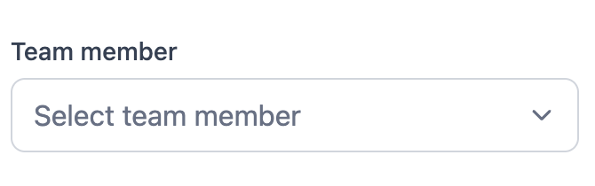
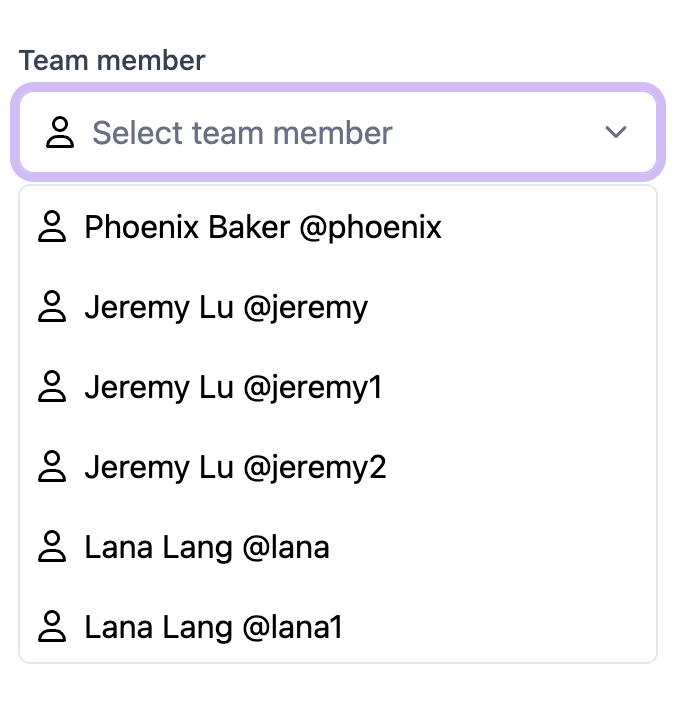

# Select Component

## Overview

The `Select` component is a versatile dropdown component for React applications. It supports various features such as search, chip list selection, and custom icons.




## Installation

To use the `Select` component, ensure you have the necessary dependencies installed:

```bash
npm install react react-dom react-icons
```

## Usage

### Basic Usage

```typescript
import Select from "./components/select";
import { DUMMY_OPTIONS } from "./data/dummy";

const handleSelectChange = (value: string) => {
  console.log("Selected value: ", value);
};

<Select
  label="Team member"
  placeholder="Select team member"
  options={DUMMY_OPTIONS}
  onChange={handleSelectChange}
/>;
```

### With Icons

```typescript
import { FaRegUser } from "react-icons/fa6";

<Select
  showItemIcon
  label="Team member"
  placeholder="Select team member"
  options={DUMMY_OPTIONS}
  icon={<FaRegUser />}
  onChange={handleSelectChange}
/>;
```

### Searchable Select

```typescript
import { CiSearch } from "react-icons/ci";

<Select
  variant="search"
  label="Team member"
  placeholder="Select team member"
  options={DUMMY_OPTIONS}
  icon={<CiSearch />}
  onChange={handleSelectChange}
/>;
```

### Chip List Select

```typescript
<Select
  showItemIcon
  label="Team member"
  placeholder="Select team member"
  options={DUMMY_OPTIONS}
  onChange={handleSelectChange}
  variant="chipList"
/>
```

## Props

### SelectProps

| Prop           | Type                                             | Default                 | Description                                   |
| -------------- | ------------------------------------------------ | ----------------------- | --------------------------------------------- |
| `options`      | `Option[]`                                       | `[]`                    | Array of options to display in the dropdown.  |
| `placeholder`  | `string`                                         | `"Select an option"`    | Placeholder text when no option is selected.  |
| `helperText`   | `string`                                         | `undefined`             | Helper text displayed below the dropdown.     |
| `label`        | `string`                                         | `undefined`             | Label text displayed above the dropdown.      |
| `icon`         | `React.ReactNode`                                | `undefined`             | Icon displayed inside the dropdown.           |
| `showItemIcon` | `boolean`                                        | `false`                 | Whether to show icons for each item.          |
| `onChange`     | `(value: string) => void`                        | `undefined`             | Callback function when an option is selected. |
| `selectedIcon` | `React.ReactNode`                                | `undefined`             | Icon displayed for selected option.           |
| `variant`      | `SelectVariant`                                  | `SelectVariant.DEFAULT` | Variant of the select component.              |
| `disabled`     | `boolean`                                        | `false`                 | Whether the select component is disabled.     |
| `defaultValue` | `string`                                         | `undefined`             | Default value of the select component.        |
| `fieldNames`   | `{ label: string; value: string; img?: string }` | `undefined`             | Custom field names for the options.           |
| `filterSort`   | `(optionA: Option, optionB: Option) => number`   | `undefined`             | Custom filter and sort function for options.  |

### Option

| Prop    | Type     | Description                        |
| ------- | -------- | ---------------------------------- |
| `value` | `string` | The value of the option.           |
| `label` | `string` | The label of the option.           |
| `img`   | `string` | Optional image URL for the option. |

### SelectVariant

| Variant     | Description                                        |
| ----------- | -------------------------------------------------- |
| `DEFAULT`   | Default variant with basic dropdown functionality. |
| `SEARCH`    | Searchable dropdown variant.                       |
| `CHIP_LIST` | Chip list variant allowing multiple selections.    |

## License

This project is licensed under the MIT License.
